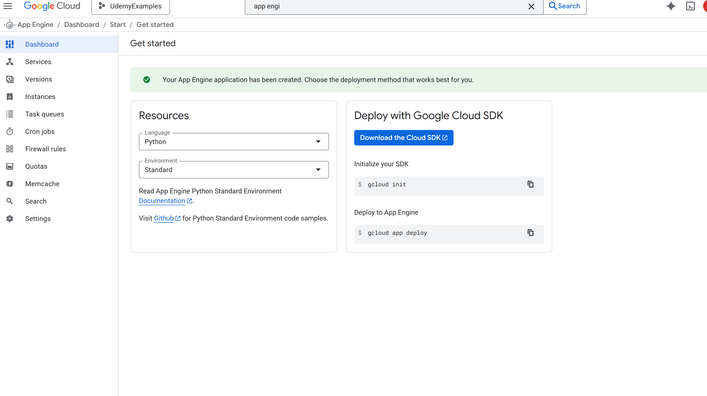
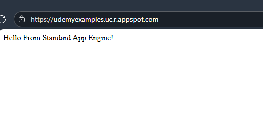
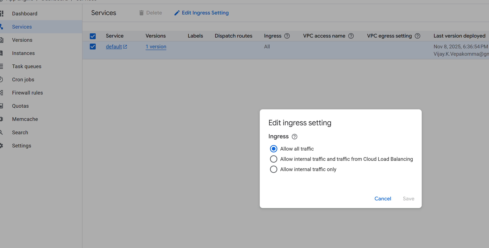

# App Engine

## Setup
- Go to App Engine, Create Project, choose defaults
- [App Engine Settings](https://console.cloud.google.com/appengine/settings?project=udemyexamples)


## Deploy
```sh
gcloud init
gcloud app deploy
gcloud browse
```
Output

- [Default Standard Service](https://udemyexamples.uc.r.appspot.com/)


## Services
- [Services](https://console.cloud.google.com/appengine/services?project=udemyexamples)


- Ingress Settings

